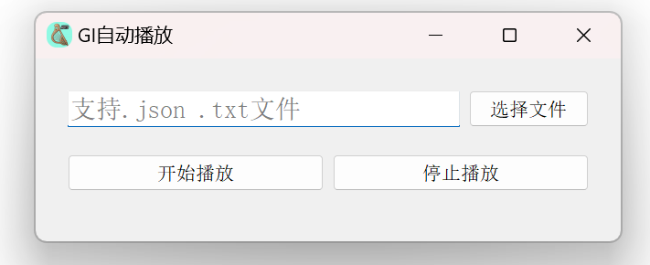
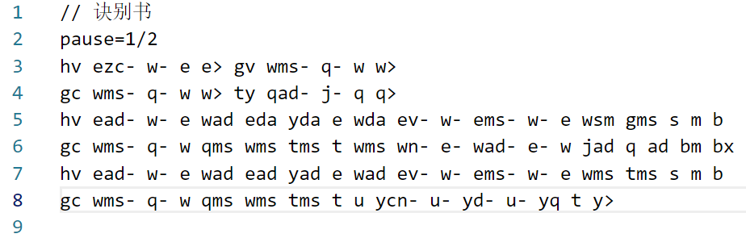

# GI Player - 原神 原琴 自动弹琴

## Description

此工具用于原神自动弹奏曲子, 花了点时间自己写了个工具, 对于不会弹琴的我来说, 可以拿着去装杯了, 哈哈哈

优点: 可以自动弹琴;

缺点: emmm, 你可能需要自己花时间把曲子凹成.txt文件, 哈哈哈, 欢迎大家一起来凹;

## 使用说明

你可以下载源码, 或者下载release里面的exe都可以, 不过你可能会遇到exe文件打不开的情况, 也许, 可能, 大概

1. 下载源码

```
git clone https://github.com/Ven3/giplayer.git

```

2. 安装依赖

```
pip install -r requirements.txt
```

3. 运行

```
python giplayer.py
```

4. 选择曲子的.json文件或者.txt文件(.json文件是根据.txt文件生成的文件)



5. 打开原神, 打开风之琴, 点击开始演奏, 等待3秒后就可以自动演奏曲子啦!!!

## 曲子txt文件编写说明

1. 双斜线 "//" 表示注释, 此行内容在演奏中不会受影响;
2. 空格用于分隔按键组;
3. 多个字母在一起表示会同时按下这几个字母;
4. pause=1/2表示每个key之后的间隔时间, 单位为"秒", 比如这里是1/2表示的就是0.5秒, 每隔0.5秒会执行下一个按键输入;
5. 空格表示按键间隔;
6. 以减号"-"结尾, 表示按这组键之后的停顿时间以pause为基础除以2, 比如pause为0.5秒, 带了"-"的这组键在按下之后, 等待0.25秒后会执行下一组键, 你可以理解为节奏会变快了;
7. 以下划线"_"结尾, 表示按这组键之后的停顿时间以pause为基础除以4, 比如pause为0.5秒, 带了"\_"的这组键在按下之后, 等待0.125秒后会执行下一组键;
8. 依此类推, 带加号"+"的时间间隔会边长, 为pause的2倍, 也就是 pause x 2;
9. 依此类推, 带加号">"的时间间隔会边长, 为pause的4倍, 也就是 pause x 4;

### 举个栗子



这首曲子叫诀别书, 第1行用"//"开头, 作为注释, 不会影响曲子;

这首曲子的默认时间间隔pause 为 0.5秒;

第3行 "hv" 两个键按下之后, 停顿pause的时间, 也就是0.5秒后会执行按键 "ezc" 操作, 而"ezc"后面带了"-"符号, 所以在"ezc"按键按下之后, 停顿0.5/2=0.25秒之后, 会执行按键"w"的操作

演奏效果可以看看这个视频 [https://v.douyin.com/i2cn6RdD](https://v.douyin.com/i2cn6RdD)
